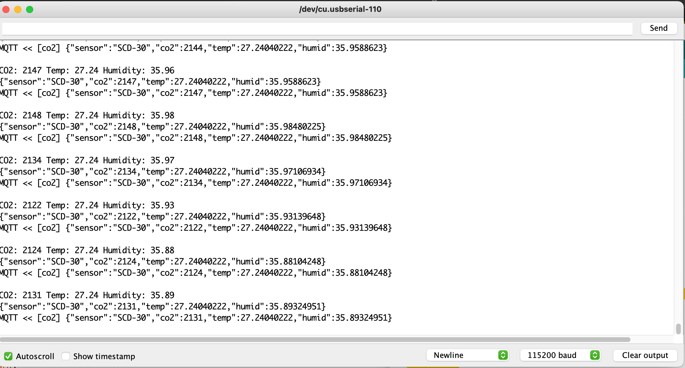
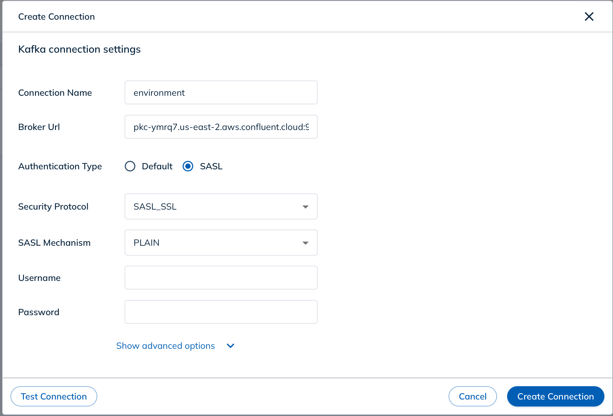
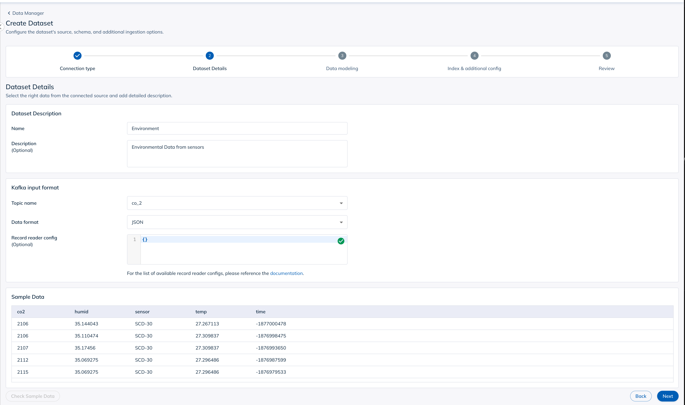
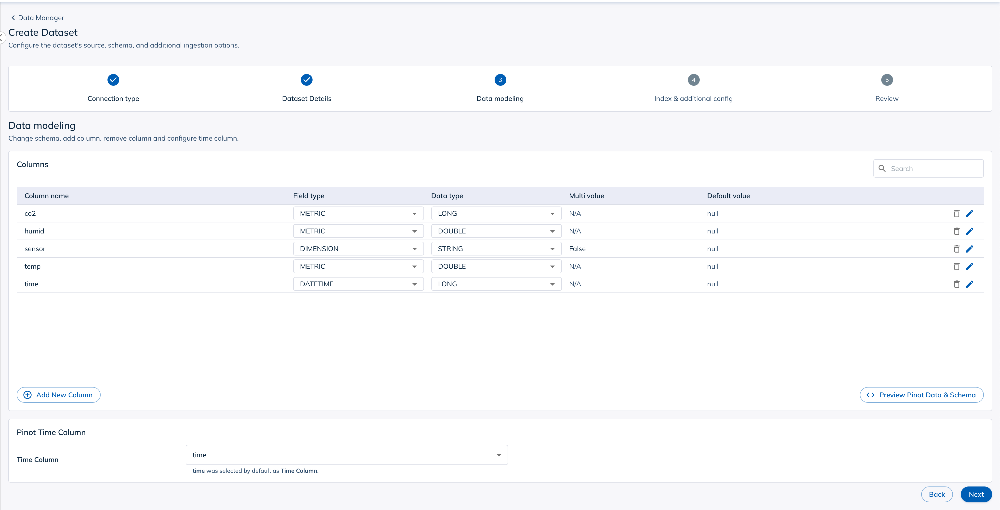
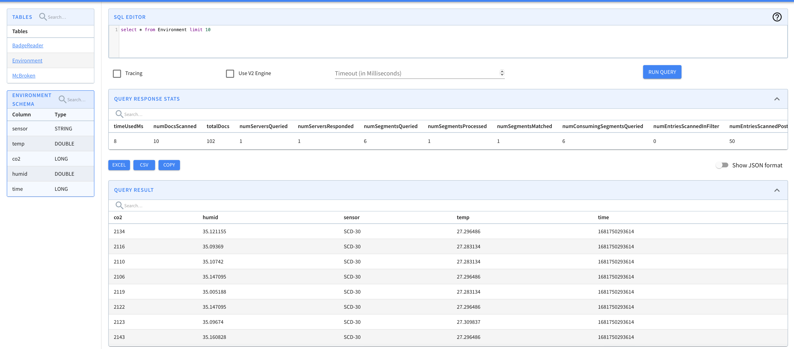

# Reading Sensor Data into Apache Pinot

This is a sample application that shows how to read sensor data from a Kafka topic and ingest it into Apache Pinot. It's both a software _and_ a hardware project, which are my favorite.

In this post we will go through how to build the sensor we'll be using, how to build the software that reads the sensor data, and how to ingest the data into Pinot. The entire thing is available on [GitHub](https://github.com/davidgs/pinot-co2-reader).

## Hardware

Hardware is part of this demo because I like building hardware, and it's always more fun to have something that you can actually interact with. The hardware we'll be building is a CO2 sensor that reads the CO2 concentration in the air, the temperature, and the relative humidity, and sends it to a Kafka topic. The sensor is based on the [SCD-30](https://www.sparkfun.com/products/15112) sensor, which is a non-dispersive infrared (NDIR) sensor that measures the CO2 concentration in the air. It's a bit expensive, but it is also an industrial-quality sensor that can be relied on to give accurate readings.

  > You will see a lot of projects based on cheaper "eCO2" sensors, but they are not as accurate as the SCD-30. I have done extensive testing of a variety of CO2 sensors and the eCO2 sensors can be off by as much as 200%, which is not something you want to rely on if accuracy matters.

The sensor is connected to an [SparkFun ESP32 Thing Plus - Qwiic](https://www.sparkfun.com/products/17743), which reads the sensor data and sends it to a Kafka topic*.

I used these 2 components specifically because they both imlement the Qwiic connector, which makes it easy to connect them together. The Qwiic connector is a standard 4-pin connector that uses I2C and is used by a number of different sensors and boards. It eliminates the need for soldering since you can just plug the sensor into the board and start coding.

The ESP-32 Feather is a great board for this project because it has built-in WiFi and Bluetooth, which makes it easy to connect to the Internet. It also has a built-in battery charger, which makes it easy to power the sensor with a battery if you want to place it somewhere out of reach. I programmed it using the Arduino IDE, which is a great tool for prototyping.

```cpp
#include <ArduinoJson.h> // Serialize and deserialize JSON
#include "EspMQTTClient.h" // handle MQTT
#include <Wire.h> // 2Wire protocol
#include "SparkFun_SCD30_Arduino_Library.h" // The CO2 Sensor

EspMQTTClient client(
  "SSID",            // Your SSID
  "PASSWD",          // Your WiFi Password
  "mqtt-broker",     // MQTT Broker server ip or hostname
  "PinotClient",     // Client name that uniquely identify your device
  8883               // The MQTT port, default to 1883. this line can be omitted
);

SCD30 airSensor; // our sensor

void setup() {
  Serial.begin(115200);
  // Optional functionalities of EspMQTTClient
  client.enableDebuggingMessages(); // Enable debugging messages sent to serial output
  client.enableHTTPWebUpdater(); // Enable the web updater. User and password default to values of MQTTUsername and MQTTPassword. These can be overridded with enableHTTPWebUpdater("user", "password").
  client.enableOTA(); // Enable OTA (Over The Air) updates. Password defaults to MQTTPassword. Port is the default OTA port. Can be overridden with enableOTA("password", port).
  Wire.begin();

  if (airSensor.begin() == false) {
    Serial.println("Air sensor not detected. Please check wiring. Freezing...");
    while (1) // infinite loop of nothingness
      ;
  }
}

// This function is called once everything is connected (Wifi and MQTT)
// WARNING : YOU MUST IMPLEMENT IT IF YOU USE EspMQTTClient
void onConnectionEstablished() {
  while (true) { // do this forever
    while (airSensor.dataAvailable()) {
      int co2 = airSensor.getCO2();
      float temp = airSensor.getTemperature();
      float hum = airSensor.getHumidity();
      StaticJsonDocument<96> doc;
      doc["sensor"] = "SCD-30";
      doc["co2"] = co2;
      doc["temp"] = temp;
      doc["humid"] = hum;
      char buff[128];
      serializeJson(doc, buff);
      serializeJson(doc, Serial); // this is for debugging
      Serial.println();
      client.publish("co2", buff); // publish the data to the co2 topic
    }
  }
}

void loop() {
  client.loop();
}
```

That's the entire Arduino sketch. It connects to WiFi, connects to an MQTT broker, and then reads the sensor data and publishes it to the `co2` topic. The code is available on [GitHub](https://github.com/davidgs/pinot-co2-reader). The SCD-30 sensor can really only provide about 1 reading/second, so there's no need to do anything fancy to make it faster.



## Getting the readings into Kafka

As it turns out there isn't a good way to get data straight from an Arduino device into Kafka which is why we sent it to the MQTT broker above. Now that it's in the MQTT broker we have to get it out and fed into our Kafka topic.

One of the other drawbacks of using an Arduino device is that they are not very good at keeping time. It is possible to use Network Time Protocol (NTP) to keep the time, but it's not very reliable. To get around these tw problems I wrote a small program in Go that reads the data from the MQTT broker, gives it an accurate timestamp, and then publishes it to a Kafka topic.

To make things easier, we will reuse some code from our Badge reader project.

**Link to Badge Reader post**

```go
 package main

import (
	"bufio"
	"crypto/tls"
	"encoding/json"
	"fmt"
	"os"
	"strings"
	"time"

	"github.com/confluentinc/confluent-kafka-go/kafka"
	MQTT "github.com/eclipse/paho.mqtt.golang"
)

/* Struct to hold the data from the MQTT message */
type env struct {
	Sensor string  `json:"sensor"`
	CO2    int32   `json:"co2"`
	Temp   float32 `json:"temp"`
	Humid  float32 `json:"humid"`
	Time   int32   `json:"time"`
}
```

That `struct` should look familiar as it's _almost_ identical to the one we used in the Arduino code. The only difference is the `Time` field, which we will use to store the timestamp.

We will also re-use all the code from the Badge Reader project to connect to Kafka and publish the data to the topic so I won't reproduce it here.

```go
/* Read MQTT messages from the specified broker and topic and send them to the kafka broker */
func ReadMQTTMessages(brokerUri string, username string, password string, topic string, qos byte) error {
	// Create an MQTT client options object
	opts := MQTT.NewClientOptions()
	// Set the broker URI, username, and password
	opts.AddBroker(brokerUri)
	opts.SetUsername(username)
	opts.SetPassword(password)
	opts.SetTLSConfig(&tls.Config{InsecureSkipVerify: true})
	// Create an MQTT client
	client := MQTT.NewClient(opts)
	if token := client.Connect(); token.Wait() && token.Error() != nil {
		return token.Error()
	}
	// Subscribe to the specified topic with the specified QoS level
	if token := client.Subscribe(topic, qos, func(client MQTT.Client, message MQTT.Message) {
		envData := env{}
		json.Unmarshal(message.Payload(), &envData)
		envData.Time = int32(time.Now().UnixMilli())
		mess, _ := json.Marshal(envData)
		fmt.Printf("Received message: %s\n", mess)
		sendToKafka("co_2", string(mess))
	}); token.Wait() && token.Error() != nil {
		return token.Error()
	}
	// Wait for messages to arrive
	for {
		select {}
	}
}

func main() {
	err := ReadMQTTMessages("tcp://broker-address:8883", "", "", "co2", 0)
	if err != nil {
		fmt.Printf("Error reading MQTT messages: %v\n", err)
	}
}
```
The `main()` function calls the `ReadMQTTMessages()` function which connects to the MQTT broker and subscribes to the `co2` topic. When a message is received it is parsed into the `env` struct, the timestamp is added, and then it is published to the Kafka topic `co_2`.

## Consuming the data

Now that we have the data in Kafka, we can begin consuming it into StarTree Cloud. Since this project is building on the previous Badge Reader project, I'm going to reuse that StarTree Cloud instance and just add a new table to it.



Since I've already been sending data to the Kafka topic, once I add the source (with the right credentials) StarTree Cloud should show me some data that it has read from the topic.



After we click through to the table we can see the data that has been read from the Kafka topic.



From there, we can go to the Pinot Query Editor and start writing queries.



## Conclusion

In this post we looked at how to use an Arduino device to read data from a sensor and send it to an MQTT broker. We then used a Go program to read the data from the MQTT broker, add a timestamp, and send it to a Kafka topic. Finally, we used StarTree Cloud to read the data from the Kafka topic and make it available for querying.

While this may not seem like much, I'll be combining this post with my previous post on Badge Reading to do some pretty fun stuff coming up so stay tuned!

If this is the kind of thing that interests and excites you, please [join our community](https://stree.ai/slack) where you can interact with other data professionals and get help with your data projects.